# Introdução

Informações básicas do projeto.

* **Projeto:** AGROCONECTA

* **Repositório GitHub:** 
  [Repo](https://github.com/ICEI-PUC-Minas-PMGES-TI/pmg-es-2026-1-ti1-0427200-agroconecta)

* **Membros da equipe:**

* Henrique de Freitas Issa
* João Vitor Alvarenga
* Danilo Amaral Nadu
* Thiago Guerra
* Heitor Henrique
* Franscisco Berutti

  * [Henrique de Freitas Issa](https://github.com/henriqu3Freitas)
  * [Danilo Amaral Nadu](https://github.com/danilonadu)
  * [Heitor Henrique](https://github.com/Torzin7)
  * [João Vitor Alvarenga](https://github.com/joaovitoralvarenga7)
  * [Thiago Guerra](https://github.com/thiagoguerra199-cpu)
  * [Franscisco Berutti](https://github.com/franciscoberutti)

A documentação do projeto é estruturada da seguinte forma:

1. Introdução
2. Contexto
3. Product Discovery
4. Product Design
5. Metodologia
6. Solução
7. Referências Bibliográficas

✅ [Documentação de Design Thinking (MIRO)](files/g9-tecnicos-agropecuarios-e-produtores.pdf)

## Contexto
Esse desafio ocorre no ambiente rural — com foco em pequenos e médios produtores — e é agravado por três barreiras principais: os "desertos de conectividade" (falta de sinal de internet e celular nas propriedades), os altos custos logísticos gerados pelas grandes distâncias, e o baixo letramento digital de muitos produtores. Sem ferramentas adequadas, a comunicação hoje é fragmentada, dependendo de ligações telefônicas esporádicas apenas quando o produtor se desloca para áreas com sinal.

## Problema
A lentidão e a dificuldade na comunicação técnica entre produtores rurais e técnicos agropecuários. Quando surgem imprevistos na lavoura (como novas pragas, mudanças climáticas ou dúvidas críticas de manejo), o produtor não consegue suporte ágil. Esse isolamento resulta em perdas de safra, uso ineficiente de insumos e insegurança produtiva. Para os técnicos, o problema se reflete na dificuldade de prospectar clientes, organizar rotas de atendimento e acompanhar o histórico das fazendas.

## Objetivos
Objetivo Geral
O objetivo geral deste trabalho é desenvolver um software para solucionar as falhas e a lentidão na comunicação entre produtores rurais e técnicos agropecuários, facilitando o acesso ágil ao suporte especializado e otimizando a prestação de serviços no campo.

Objetivos Específicos
Para que o objetivo geral seja alcançado, o projeto foca nos seguintes objetivos específicos:

Mapear e projetar uma interface acessível (UX/UI): Desenvolver um design intuitivo e adaptado para usuários com baixo letramento digital, garantindo que os produtores rurais consigam utilizar o sistema sem atritos.

Criar um sistema de conexão por geolocalização (Match): Implementar funcionalidades que permitam aos produtores encontrar os técnicos mais próximos e adequados à sua necessidade, auxiliando também na otimização das rotas de atendimento dos profissionais.

Investigar soluções para baixa conectividade: Analisar e aplicar arquiteturas de software (como o conceito offline first ou sincronização assíncrona) que permitam o uso das ferramentas básicas do aplicativo mesmo em "desertos de conectividade" no ambiente rural.

## Justificativa
No agronegócio, o tempo é crítico: o atraso na identificação de uma praga ou na correção do manejo pode custar uma safra inteira. A motivação deste projeto é democratizar o acesso à assistência técnica para pequenos e médios produtores, evitando prejuízos, uso inadequado de insumos e garantindo a rentabilidade no campo.

Os objetivos específicos foram escolhidos para atacar diretamente as maiores barreiras da realidade rural brasileira:

UX/UI Acessível: Superar o baixo letramento digital, garantindo que o produtor consiga usar o sistema sem dificuldades.

Geolocalização (Match): Combater os altos custos e a demora logística, conectando produtores aos técnicos mais próximos da sua região.

Soluções para Baixa Conectividade: Contornar os "desertos de conectividade", garantindo que as funções essenciais do aplicativo funcionem mesmo sem internet na lavoura.

Dessa forma, o projeto se justifica pela entrega de uma solução realista, que não apenas introduz tecnologia, mas se adapta às limitações estruturais do ambiente rural.

## Público-Alvo
A aplicação é direcionada para o mercado do agronegócio, atuando como uma ponte entre dois perfis de usuários com características e necessidades complementares:

1. Produtores Rurais (Pequenos e Médios)

Perfil e Conhecimento: São os tomadores de decisão na propriedade. Possuem amplo conhecimento prático e empírico da terra, mas muitas vezes carecem de embasamento científico atualizado para lidar com imprevistos (como novas pragas ou mudanças climáticas).

Relação com a Tecnologia: Apresentam letramento digital de baixo a moderado. Utilizam ferramentas básicas no dia a dia (como WhatsApp), mas têm resistência a plataformas complexas. Além disso, lidam rotineiramente com a falta de sinal de internet na lavoura.

2. Técnicos Agropecuários e Agrônomos

Perfil e Conhecimento: Profissionais com formação técnica ou superior que detêm o conhecimento científico. Podem atuar como consultores autônomos, extensionistas de órgãos públicos ou funcionários de cooperativas agrícolas.

Relação com a Tecnologia: Possuem alta familiaridade com smartphones e ferramentas digitais. Buscam ativamente tecnologias que otimizem seu tempo, organizem suas rotas logísticas de atendimento e facilitem a prospecção de novos clientes na região.

# Product Discovery

## Etapa de Entendimento
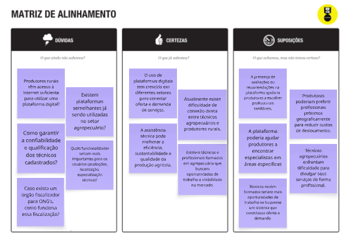
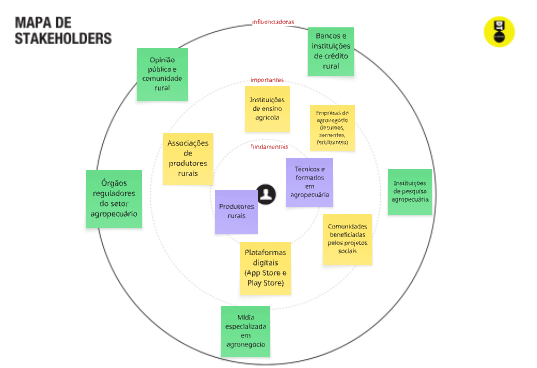
1. Mapa de Stakeholders
O mapa organiza os envolvidos no ecossistema do projeto em três níveis de proximidade e influência:

Pessoas Fundamentais (Centro): São os usuários diretos e principais afetados pelo problema da falta de assistência técnica ágil. No mapa, este grupo é composto pelos Produtores Rurais (Pequenos e Médios) e pelos Técnicos Agropecuários/Agrônomos (autônomos, de cooperativas ou órgãos públicos).

Pessoas Importantes (Círculo Intermediário): São entidades que facilitam ou dificultam a viabilidade e a adoção da solução no campo. Estão listados: Cooperativas Agrícolas (que gerenciam grupos de técnicos e produtores), Lojas de Insumos (que muitas vezes oferecem assistência técnica como parte da venda), Instituições de Ensino Agrícola (formadoras de novos técnicos) e Sindicatos Rurais.

Pessoas Influenciadoras (Círculo Externo): São órgãos ou contextos que definem regras, fornecem dados ou influenciam o mercado em macro escala. Inclui: Ministério da Agricultura (MAPA) (regulação de defensivos e práticas), Órgãos de Extensão Rural (ex: EMATER) (que definem políticas de assistência), EMBRAPA (fornecedora de dados técnicos oficiais), Provedores de Internet Rural (viabilidade tecnológica) e Associações de Classe (ex: CREA-CONFEA).

2. Matriz de Alinhamento CSD
Certezas (O que já sabemos)

A falta de conectividade (internet/sinal) nas propriedades rurais é um gargalo real e crítico.

O tempo de resposta entre o surgimento de um problema (praga/clima) e a visita técnica determina a perda ou o sucesso da safra.

A assistência técnica preventiva e contínua reduz custos e danos ambientais no longo prazo.

A maioria dos produtores já utiliza canais simples de comunicação digital (como WhatsApp/SMS) onde há sinal.

O custo logístico (combustível, tempo de deslocamento) é o maior entrave para os técnicos cobrirem suas regiões de atendimento.

Suposições (O que achamos, mas não temos certeza)

As soluções baseadas no conceito "offline first" com sincronização assíncrona são a chave para a adoção tecnológica no campo.

Produtores rurais com menor letramento digital terão forte resistência ao uso de aplicativos, exigindo interfaces baseadas em áudio e ícones visuais.

Um sistema de conexão por geolocalização e histórico digital da propriedade aumentaria significativamente a confiança e a transparência entre as duas pontas (técnico e produtor).

A rede de indicação presencial ("boca a boca") local ainda tem mais peso na escolha do técnico do que uma avaliação digital.

Dúvidas (O que ainda não sabemos)

Quais seriam as funcionalidades essenciais ("must-have") do sistema que não podem depender de internet no momento do uso?

Qual o nível real de letramento digital dos produtores e quanto tempo eles estariam dispostos a dedicar ao uso do sistema?

Os técnicos estabelecidos estariam dispostos a migrar o controle da sua carteira de clientes e agendamentos para uma nova plataforma exclusiva?

Qual modelo de custo ou incentivo garantiria a adesão das cooperativas e órgãos públicos como intermediadores do sistema?

## Etapa de Definição

### Personas

**✳️✳️✳️ APRESENTE OS DIAGRAMAS DE PERSONAS ✳️✳️✳️**

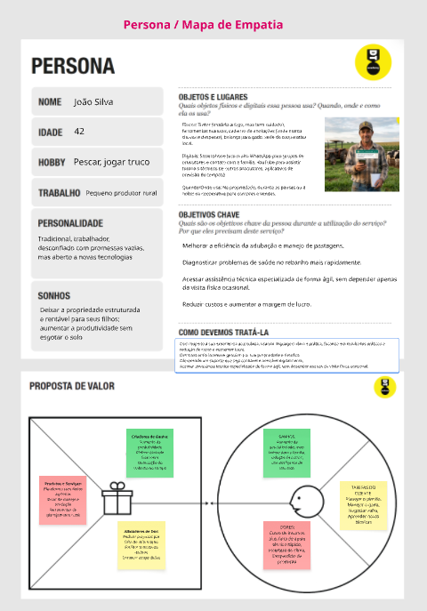

1. O Pequeno Produtor Rural Traditional (Persona: João Silva)
Papel: Receptor de Conhecimento / Usuário de Manejo.

Perfil: Tradicional (42 anos), pescador e jogador de truco nas horas vagas. Trabalhador, experiente, mas desconfiado de promessas vazias. Aberto a novas tecnologias, desde que provem resultados reais e sustentáveis.

Relação com a Solução (Dores e Objetivos):

Dores: Alto custo de insumos, falta de apoio técnico ágil e especializado (dependendo de visitas físicas ocasionais) e incerteza climática, o que leva ao desperdício de produção.

Objetivos: Melhorar a eficiência de manejo (pastagens/adubação), diagnosticar problemas de saúde no rebanho rapidamente, reduzir custos e aumentar a margem de lucro. Seu grande sonho é deixar a propriedade estruturada e rentável para seus filhos, de forma sustentável.

Como a Solução o Atende: A plataforma deve oferecer assistência técnica especializada de forma ágil e digital, sem depender exclusivamente de visitas físicas ocasionais, focando em ferramentas de manejo rural eficientes e sustentáveis.

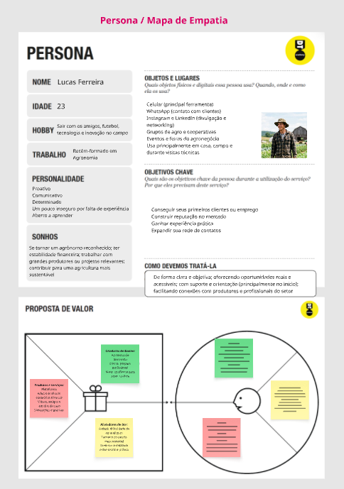

2. O Técnico Agrônomo Recém-Formado (Persona: Lucas Ferreira)
Papel: Provedor de Conhecimento Técnico.

Perfil: Jovem (23 anos), proativo, comunicativo, apaixonado por tecnologia e inovação no campo. Formado recentemente em Agronomia.

Relação com a Solução (Dores e Objetivos):

Dores: Insegurança por falta de experiência prática e grande dificuldade em conseguir os primeiros clientes ou emprego estável no mercado para construir reputação.

Objetivos: Ganhar experiência prática, expandir sua rede de contatos, construir reputação no mercado e alcançar estabilidade financeira para se tornar um agrônomo reconhecido.

Como a Solução o Atende: A plataforma deve atuar como uma vitrine de oportunidades, conectando-o a produtores que precisam de consultoria, além de oferecer suporte e orientação para o início de sua carreira prática.

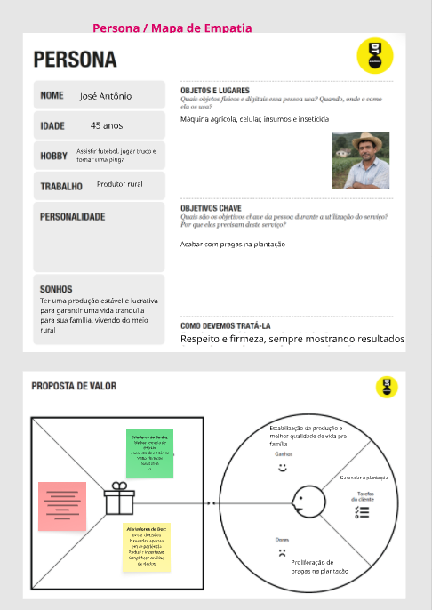

3. O Produtor Rural Resiliente em Contexto Precário (Persona: Paulo Ferreira)
Papel: Receptor de Conhecimento / Usuário de Tecnologia Adaptada.

Perfil: Criador de animais e produtor rural (48 anos), resiliente e dedicado à família. Localizado no interior do Mato Grosso, vive em um contexto de infraestrutura precária.

Relação com a Solução (Dores e Objetivos):

Dores: A falta de tecnologia na região afeta diretamente a eficiência de seu trabalho e sua produtividade. Ele utiliza ferramentas e materiais simples para o cuidado diário.

Objetivos: Aumentar a eficiência da produção e melhorar suas condições de trabalho e as da fazenda através da adoção de tecnologia. Ele sonha com estabilidade financeira e melhores ferramentas.

Como a Solução o Atende: A plataforma deve fornecer consultoria tecnológica agropecuária adaptada e treinamento para o uso de novas ferramentas (como dados de clima e mercado em tempo real), superando o isolamento tecnológico de sua região.

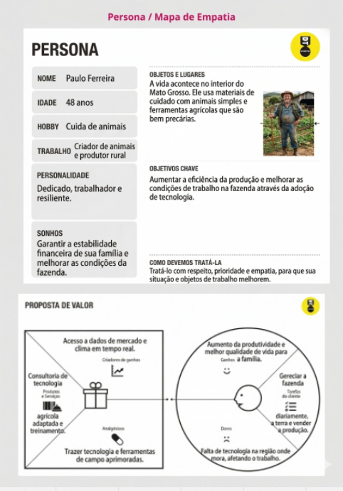

4. O Produtor Rural Focado em Resultados e Gestão (Persona: José Antônio)
Papel: Receptor de Conhecimento / Usuário de Gestão de Crises.

Perfil: Produtor Rural (45 anos), pragmático, focado em futebol e truco. Trabalhador experiente, tem como foco total a lucratividade e estabilidade da produção para sustentar a família.

Relação com a Solução (Dores e Objetivos):

Dores: A principal dor é a proliferação de pragas em sua plantação, o que ameaça diretamente sua renda e sonhos. Ele se sente inseguro tomando decisões baseadas apenas em experiência passada.

Objetivos: Acabar com as pragas e garantir uma produção estável e lucrativa. Ele precisa de uma solução que simplifique a análise de dados e lhe dê confiança de que está tomando a decisão certa.

Como a Solução o Atende: A plataforma deve fornecer consultoria técnica focada em diagnósticos rápidos e precisos para controle de pragas, além de ferramentas de consultoria técnica que simplifiquem a análise de dados, permitindo decisões ágeis e baseadas em evidências.

# Product Design

Nesse momento, vamos transformar os insights e validações obtidos em soluções tangíveis e utilizáveis. Essa fase envolve a definição de uma proposta de valor, detalhando a prioridade de cada ideia e a consequente criação de wireframes, mockups e protótipos de alta fidelidade, que detalham a interface e a experiência do usuário.

## Histórias de Usuários

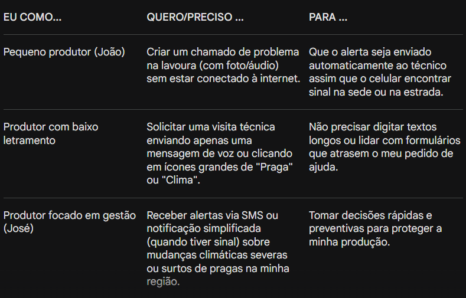
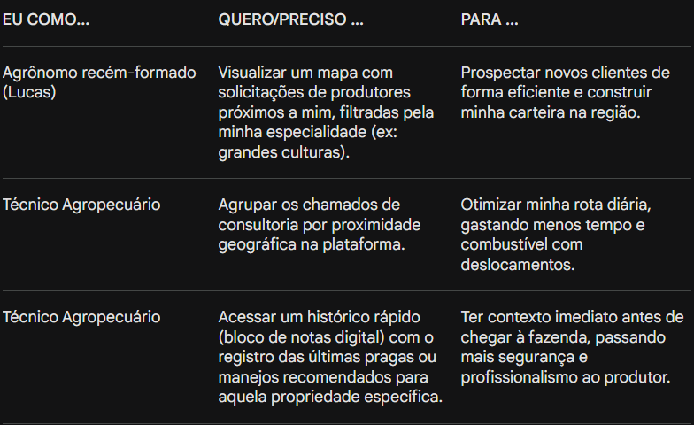

## Proposta de Valor

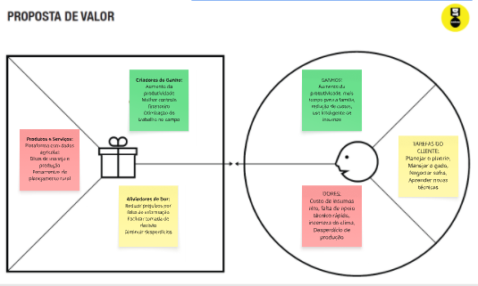
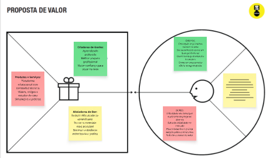
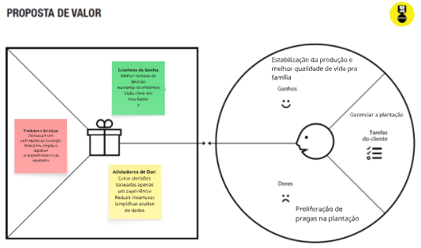
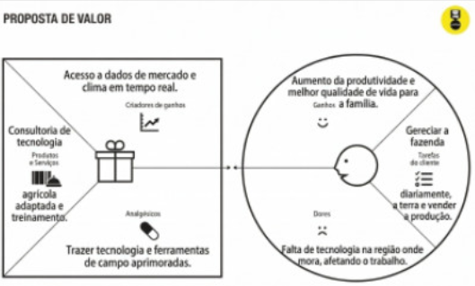

João Silva (Pequeno Produtor Rural Tradicional)
Para João Silva, a proposta de valor está na democratização do acesso à assistência técnica especializada de forma ágil e sob demanda. A plataforma permite que ele solicite ajuda profissional ao primeiro sinal de problema na lavoura ou no rebanho (como dúvidas de adubação ou manejo), sem depender exclusivamente da disponibilidade para visitas físicas ocasionais. Ao facilitar o diagnóstico rápido e fornecer orientações precisas, o sistema ajuda a evitar o desperdício de insumos caros, reduz os riscos climáticos e operacionais, e contribui para que ele mantenha sua propriedade rentável, sustentável e estruturada para as próximas gerações.

Lucas Ferreira (Técnico Agrônomo Recém-Formado)
A proposta de valor para Lucas Ferreira consiste em oferecer uma vitrine digital que o conecte diretamente a produtores rurais de sua região, facilitando a prospecção de seus primeiros clientes e a construção de sua reputação no mercado. A plataforma utiliza um sistema inteligente de geolocalização que otimiza suas rotas de atendimento, reduzindo drasticamente os custos e o tempo de deslocamento. Além disso, fornece ferramentas integradas para o registro do histórico das propriedades, permitindo que ele organize sua carteira de clientes e entregue um serviço de consultoria mais profissional, seguro e embasado desde o início de sua carreira.

José Antônio (Produtor Rural Focado em Resultados e Gestão)
A proposta de valor para José Antônio centra-se na segurança produtiva e na resolução imediata de crises que ameaçam sua rentabilidade, como a proliferação de pragas. A plataforma oferece um canal direto, focado em resultados práticos, para contatar especialistas que fornecem diagnósticos rápidos e precisos. Ao simplificar o fluxo de comunicação e o envio de evidências do campo, o sistema agiliza a tomada de decisão técnica. Com isso, atua como uma ferramenta de estabilização da lavoura, evitando perdas financeiras severas na safra e garantindo a qualidade de vida e a tranquilidade que ele busca para sua família.

Paulo Ferreira (Produtor Rural Resiliente em Contexto Precário)
A proposta de valor para Paulo Ferreira baseia-se na entrega de uma tecnologia inclusiva e totalmente adaptada à realidade estrutural e de baixa conectividade do interior. Através de uma arquitetura offline first e de uma interface ultrassimplificada (focada em ícones visuais e mensagens de voz), a plataforma quebra a barreira do isolamento tecnológico. O sistema permite que ele registre demandas da fazenda mesmo sem sinal de internet, garantindo acesso facilitado a consultorias especializadas. Dessa forma, ele consegue superar as limitações de sua região, melhorando suas condições diárias de trabalho e aumentando a eficiência de sua produção.

## Requisitos

As tabelas que se seguem apresentam os requisitos funcionais e não funcionais que detalham o escopo do projeto.

### Requisitos Funcionais

| ID     | Descrição do Requisito                                   | Prioridade |
| ------ | ---------------------------------------------------------- | ---------- |
| RF-001 | Permitir que o usuário cadastre tarefas ⚠️ EXEMPLO ⚠️ | ALTA       |
| RF-002 | Emitir um relatório de tarefas no mês ⚠️ EXEMPLO ⚠️ | MÉDIA     |

### Requisitos não Funcionais

| ID      | Descrição do Requisito                                                              | Prioridade |
| ------- | ------------------------------------------------------------------------------------- | ---------- |
| RNF-001 | O sistema deve ser responsivo para rodar em um dispositivos móvel ⚠️ EXEMPLO ⚠️ | MÉDIA     |
| RNF-002 | Deve processar requisições do usuário em no máximo 3s ⚠️ EXEMPLO ⚠️          | BAIXA      |

> ⚠️ **APAGUE ESSA PARTE ANTES DE ENTREGAR SEU TRABALHO**
>
> Os requisitos de um projeto são classificados em dois grupos:
>
> - [Requisitos Funcionais (RF)](https://pt.wikipedia.org/wiki/Requisito_funcional):
>   correspondem a uma funcionalidade que deve estar presente na plataforma (ex: cadastro de usuário).
> - [Requisitos Não Funcionais (RNF)](https://pt.wikipedia.org/wiki/Requisito_n%C3%A3o_funcional):
>   correspondem a uma característica técnica, seja de usabilidade, desempenho, confiabilidade, segurança ou outro (ex: suporte a dispositivos iOS e Android).
>
> Lembre-se que cada requisito deve corresponder à uma e somente uma característica alvo da sua solução. Além disso, certifique-se de que todos os aspectos capturados nas Histórias de Usuário foram cobertos.
>
> **Orientações**:
>
> - [O que são Requisitos Funcionais e Requisitos Não Funcionais?](https://codificar.com.br/requisitos-funcionais-nao-funcionais/)
> - [O que são requisitos funcionais e requisitos não funcionais?](https://analisederequisitos.com.br/requisitos-funcionais-e-requisitos-nao-funcionais-o-que-sao/)

## Projeto de Interface

Artefatos relacionados com a interface e a interacão do usuário na proposta de solução.

### Wireframes
Estes são os protótipos de telas do sistema.

TELA INICIAL (LANDING PAGE)
A Tela Inicial atua como a porta de entrada da plataforma, projetada com uma interface limpa e sem distrações visuais para atender perfeitamente aos usuários com menor familiaridade digital. Seu objetivo principal é comunicar a proposta de valor de forma imediata e segmentar o público (produtores e técnicos) para seus respectivos fluxos de navegação.

Elementos principais:

Cabeçalho (Header): Contém o logotipo para identificação, uma barra de pesquisa proeminente no topo (para buscas rápidas de profissionais ou artigos) e o acesso direto para "Login/Cadastro".

Área de Destaque (Hero Section): Traz a mensagem central ("Conectando profissionais com produtores rurais") de forma legível e direta. Ao lado, há um espaço para uma imagem humanizada que gere conexão e confiança no usuário do campo. A navegação é imediatamente dividida por dois grandes botões de ação: "Buscar profissionais" (direcionando o produtor rural) e "Sou profissional" (direcionando o agrônomo/técnico).

Seção "Como funciona?": Uma área educativa dividida em duas colunas ("Para produtores" e "Para profissionais"). Isso é crucial para reduzir a resistência tecnológica, explicando em poucos passos como a plataforma resolve os problemas específicos de cada uma das nossas personas (como o João e o Lucas).

Rodapé (Footer): Rodapé institucional contendo "Sobre nós", "Contato" (fundamental para oferecer suporte e passar credibilidade) e "Redes sociais".

 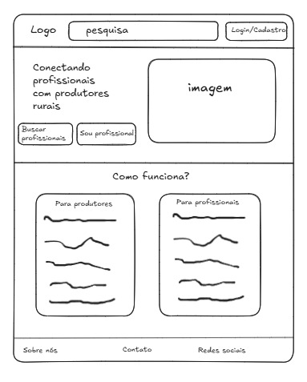

### User Flow

[User Flow](files/user-flow.pdf)

### Protótipo Interativo


✅ [Protótipo Interativo](files/prototipo-iterativo.pdf) 


# Metodologia

Detalhes sobre a organização do grupo e o ferramental empregado.

## Ferramentas

Relação de ferramentas empregadas pelo grupo durante o projeto.

| Ambiente                    | Plataforma | Link de acesso                                     |
| --------------------------- | ---------- | -------------------------------------------------- |
| Processo de Design Thinking | Miro       | [link miro](https://miro.com/app/board/uXjVGvSAe1g=/?share_link_id=832951129402)        |
| Repositório de código     | GitHub     |   [link github](https://github.com/ICEI-PUC-Minas-PMGES-TI/pmg-es-2026-1-ti1-0427200-agroconecta)    |
| Hospedagem do site          | Render     | https://site.render.com/XXXXXXX ⚠️ EXEMPLO ⚠️ |
| Protótipo Interativo       | Figma  | [link figma](https://www.figma.com/make/zwHdBmkiTAF6E5yqi3E9l7/Agroconecta-site-creation?p=f&t=PZ1OVJVYKDJTfmXR-0)   |
|                             |            |                                                    |

## Gerenciamento do Projeto

Divisão de papéis no grupo e apresentação da estrutura da ferramenta de controle de tarefas (Kanban).

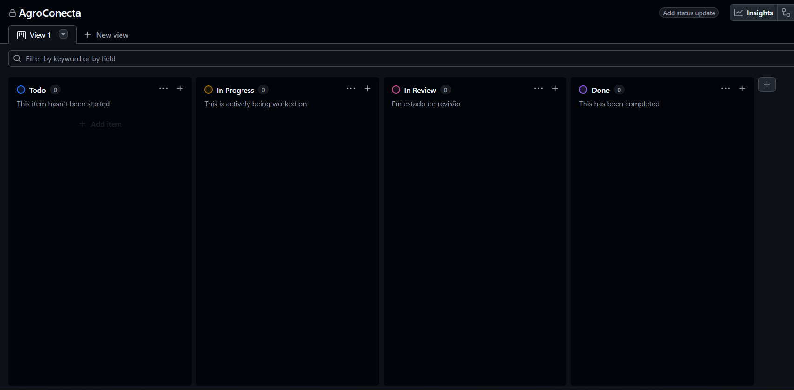

Ferramentas e Gestão de Configuração
Para a gestão de configuração e controle de tarefas, o projeto utiliza o ambiente do GitHub. A ferramenta GitHub Projects foi implementada para fornecer visibilidade do fluxo de trabalho através de um quadro Kanban.

Como ilustrado abaixo, o fluxo das tarefas (issues) transita pelas seguintes etapas:

Todo (A Fazer): Tarefas priorizadas e refinadas, aguardando início.

In Progress (Em Andamento): Itens que estão sendo ativamente codificados ou desenhados pela equipe de desenvolvimento.

In Review (Em Revisão): Funcionalidades concluídas que aguardam testes de qualidade ou aprovação de Pull Requests (revisão de código por outros membros).

Done (Concluído): Tarefas aprovadas e integradas com sucesso à versão principal do projeto.

> ⚠️ **APAGUE ESSA PARTE ANTES DE ENTREGAR SEU TRABALHO**
>
> Nesta parte do documento, você deve apresentar  o processo de trabalho baseado nas metodologias ágeis, a divisão de papéis e tarefas, as ferramentas empregadas e como foi realizada a gestão de configuração do projeto via GitHub.
>
> Coloque detalhes sobre o processo de Design Thinking e a implementação do Framework Scrum seguido pelo grupo. O grupo poderá fazer uso de ferramentas on-line para acompanhar o andamento do projeto, a execução das tarefas e o status de desenvolvimento da solução.

# Solução Implementada

Esta seção apresenta todos os detalhes da solução criada no projeto.

## Vídeo do Projeto

O vídeo a seguir traz uma apresentação do problema que a equipe está tratando e a proposta de solução. ⚠️ EXEMPLO ⚠️

[](https://www.youtube.com/embed/70gGoFyGeqQ)

> ⚠️ **APAGUE ESSA PARTE ANTES DE ENTREGAR SEU TRABALHO**
>
> O video de apresentação é voltado para que o público externo possa conhecer a solução. O formato é livre, sendo importante que seja apresentado o problema e a solução numa linguagem descomplicada e direta.
>
> Inclua um link para o vídeo do projeto.

## Funcionalidades

Esta seção apresenta as funcionalidades da solução.Info

##### Funcionalidade 1 - Cadastro de Contatos ⚠️ EXEMPLO ⚠️

Permite a inclusão, leitura, alteração e exclusão de contatos para o sistema

* **Estrutura de dados:** [Contatos](#ti_ed_contatos)
* **Instruções de acesso:**
  * Abra o site e efetue o login
  * Acesse o menu principal e escolha a opção Cadastros
  * Em seguida, escolha a opção Contatos
* **Tela da funcionalidade**:


> ⚠️ **APAGUE ESSA PARTE ANTES DE ENTREGAR SEU TRABALHO**
>
> Apresente cada uma das funcionalidades que a aplicação fornece tanto para os usuários quanto aos administradores da solução.
>
> Inclua, para cada funcionalidade, itens como: (1) titulos e descrição da funcionalidade; (2) Estrutura de dados associada; (3) o detalhe sobre as instruções de acesso e uso.

## Estruturas de Dados

Descrição das estruturas de dados utilizadas na solução com exemplos no formato JSON.Info

##### Estrutura de Dados - Contatos   ⚠️ EXEMPLO ⚠️

Contatos da aplicação

```json
  {
    "id": 1,
    "nome": "Leanne Graham",
    "cidade": "Belo Horizonte",
    "categoria": "amigos",
    "email": "Sincere@april.biz",
    "telefone": "1-770-736-8031",
    "website": "hildegard.org"
  }
  
```

##### Estrutura de Dados - Usuários  ⚠️ EXEMPLO ⚠️

Registro dos usuários do sistema utilizados para login e para o perfil do sistema

```json
  {
    id: "eed55b91-45be-4f2c-81bc-7686135503f9",
    email: "admin@abc.com",
    id: "eed55b91-45be-4f2c-81bc-7686135503f9",
    login: "admin",
    nome: "Administrador do Sistema",
    senha: "123"
  }
```

> ⚠️ **APAGUE ESSA PARTE ANTES DE ENTREGAR SEU TRABALHO**
>
> Apresente as estruturas de dados utilizadas na solução tanto para dados utilizados na essência da aplicação quanto outras estruturas que foram criadas para algum tipo de configuração
>
> Nomeie a estrutura, coloque uma descrição sucinta e apresente um exemplo em formato JSON.
>
> **Orientações:**
>
> * [JSON Introduction](https://www.w3schools.com/js/js_json_intro.asp)
> * [Trabalhando com JSON - Aprendendo desenvolvimento web | MDN](https://developer.mozilla.org/pt-BR/docs/Learn/JavaScript/Objects/JSON)

## Módulos e APIs

Esta seção apresenta os módulos e APIs utilizados na solução

**Images**:

* Unsplash - [https://unsplash.com/](https://unsplash.com/) ⚠️ EXEMPLO ⚠️

**Fonts:**

* Icons Font Face - [https://fontawesome.com/](https://fontawesome.com/) ⚠️ EXEMPLO ⚠️

**Scripts:**

* jQuery - [http://www.jquery.com/](http://www.jquery.com/) ⚠️ EXEMPLO ⚠️
* Bootstrap 4 - [http://getbootstrap.com/](http://getbootstrap.com/) ⚠️ EXEMPLO ⚠️

> ⚠️ **APAGUE ESSA PARTE ANTES DE ENTREGAR SEU TRABALHO**
>
> Apresente os módulos e APIs utilizados no desenvolvimento da solução. Inclua itens como: (1) Frameworks, bibliotecas, módulos, etc. utilizados no desenvolvimento da solução; (2) APIs utilizadas para acesso a dados, serviços, etc.

# Referências

As referências utilizadas no trabalho foram:

* SOBRENOME, Nome do autor. Título da obra. 8. ed. Cidade: Editora, 2000. 287 p ⚠️ EXEMPLO ⚠️

> ⚠️ **APAGUE ESSA PARTE ANTES DE ENTREGAR SEU TRABALHO**
>
> Inclua todas as referências (livros, artigos, sites, etc) utilizados no desenvolvimento do trabalho.
>
> **Orientações**:
>
> - [Formato ABNT](https://www.normastecnicas.com/abnt/trabalhos-academicos/referencias/)
> - [Referências Bibliográficas da ABNT](https://comunidade.rockcontent.com/referencia-bibliografica-abnt/)
